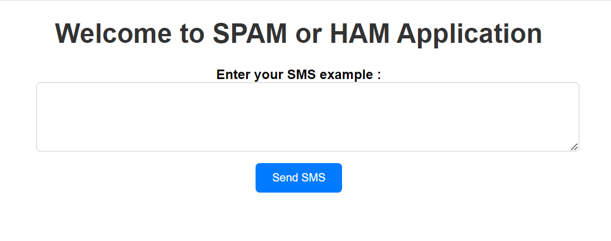

# Deploy_ML_Model_into_cloud

In this project, I build a spam detector using machine learning and launch it as a serverless API into AWS virtual servers.\
I use basic Logistic Regression model to build the spam detector and the Flask python framework to create the API.

## Development Steps
1. Build a Logistic Regression model to detect spams in sms messages: SpamDetector.ipynb
    - Import datasets: spam_train.csv & spam_test.csv 
    - Process SMS messages: Tokenizing & removing stop words & stemming
    - Vectorize the data before training & testing the model
    - Use Pickle to serialize and deserialize the trained model and the vectorizer function\
      => ./version_1/spam_ham_model.pkl & ./version_1/vectorizer.pkl

2. Create a Flask application using basic HTML and CSS files
      => ./version_1/application.py  

3. Deploy the application into AWS virtual servers
    - Prepare the deployment file: Archive version_1 into .zip file
    - Upload the source code to AWS Elastic Beanstalk
    - Connect to the application using the returned URL

## Test Locally
git clone https://github.com/WaelLABASSI/SpamOrHam_Application.git

cd Deploy_ML_Model_into_cloud/version_1

conda create -n envname--file requirements.txt

conda activate envname

python ./application.py

Example of HAM sms: Hello there. How are you doing?

Example of SPAM sms: you won $900 in the new lottery draw. Call +123456789.

## Credits
COURSERA Project Network: Deploy Machine Learning Model into AWS Cloud Servers
